c-cdd
=====

[](https://opensource.org/licenses/Apache-2.0)
[](https://github.com/SamuelMarks/cdd-c/actions/workflows/linux-Windows-macOS.yml)
[`#rewriteInC`](https://rewriteInC.io)

[](https://en.wikipedia.org/wiki/C89_(C_version))

Frontend for C, concentrating on: generation from code; single-file analysis; modification; and emission (to C code).

Use-cases:

- Generate/update `free` calling `int StructName_cleanup(struct StructName*)` functions, e.g.:
    - `struct Foo { struct Bar *bar;}; struct Bar { int a; };` will generate:
    - `int Bar_cleanup(struct Bar*);` &
    - `int Foo_cleanup(struct Foo*);` (which internally will call `Bar_cleanup`)
- With `fmt` of JSON, INI, YAML, TOML, &etc.:
    - Generate/update parsers from `const char*` to `struct`:
      `const int StructName_<fmt>_parse(struct StructName*, const char*)` function;
    - Generate/update emitters from `struct` to `char*`:
      `const int StructName_<fmt>_emit(const struct StructName*, char*)` function;
- And helper functions inspired by Haskell typeclasses & Rust traits like:
    - `bool StructName_eq(struct StructName*, struct StructName*);`
    - `int StructName_default(struct StructName*);`
    - `int StructName_deepcopy(const struct StructName*, struct StructName*);`
    - `int StructName_display(struct StructName*, FILE*);`
    - `int StructName_debug(struct StructName*, FILE*);`
- Generate the Google Cloud client library for C (
  with [Google Cloud API Discovery Service](https://developers.google.com/discovery/v1/reference) as input);
- Generate arbitrary C client libraries (with [OpenAPI](https://spec.openapis.org/oas/v3.1.0) as input);
- Generating `#pragma` for every function to expose them for calling from,
  e.g., [assembly](https://www.ibm.com/docs/en/zos/2.5.0?topic=programs-calling-c-code-from-assembler-c-example);
- Prepare C SDK to be wrapped in higher-level language SDKs ([SWIG](https://en.wikipedia.org/wiki/SWIG) style)

## Why

In 2025, IMHO, there are four reasons to write in C:

  0. Maintain an existing codebase;
  1. Write low-level code (e.g., kernels, drivers, microcontrollers, compilers, assembly helpers);
  2. Write performant code (e.g., databases, filesystems, math libraries);
  3. Write interoperable code.

The focus of this venture is the final point… **interoperability**:

```mermaid
graph TD
  C[C]

  C --> C++
  C --> C#
  C --> Objective-C
  C --> Java
  C --> Python
  C --> Go
  C --> Rust
  C --> JavaScript
  C --> Perl
  C --> PHP

  C --> Swift
  C --> Kotlin
  C --> Lua
  C --> D
  C --> Scala
  C --> Tcl
  C --> Ruby
  C --> Fortran
  C --> Ada

  C --> Haskell
  C --> Elixir
  C --> Julia
  C --> Groovy
  C --> Crystal
  C --> Nim
  C --> OCaml
  C --> V
  C --> Eiffel
  C --> F#

  C --> TypeScript
  C --> COBOL
  C --> SQL
  C --> MATLAB
  C --> Lisp
  C --> Prolog
  C --> Dart
  C --> Erlang

  C --> R
  C --> Zig
  C --> Forth
```



(40 popular programming languages which can easily call into C)

## Design

This C compiler has a very unusual design, the macro and C languages are treated as one. The foci are:

- location start/end of function, `struct`, and feature macros (e.g., `#ifdef JSON_EMIT` then `#endif /* JSON_EMIT */`);
- `struct` fields.

…which enables a number of use-cases to be simply developed, e.g., see the list above.

### Drawbacks

- Macros aren't evaluated, which means a simple `#define LBRACE {` will break cdd-c.
- Like [`m4`](https://en.wikipedia.org/wiki/M4_(computer_language)), CMake, and other tools; cdd-c must be run before
  your code is built.

### Development guide

Install: CMake ; C compiler toolchain ; git. Then:

```sh
$ git clone "https://github.com/offscale/vcpkg" -b "project0"
# Windows:
$ vcpkg\bootstrap-vcpkg.bat
# Non-Windows:
$ ./vcpkg/bootstrap-vcpkg.sh
# Both Windows and non-Windows:
$ git clone "https://github.com/SamuelMarks/cdd-c" && cd "cdd-c"  # Or your fork of this repo
# Windows
$ cmake -DCMAKE_BUILD_TYPE="Debug" -DCMAKE_TOOLCHAIN_FILE="..\vcpkg\scripts\buildsystems\vcpkg.cmake" -S . -B "build"
# Non-Windows
$ cmake -DCMAKE_BUILD_TYPE='Debug' -DCMAKE_TOOLCHAIN_FILE='../vcpkg/scripts/buildsystems/vcpkg.cmake' -S . -B 'build'
# Both Windows and non-Windows:
$ cmake --build "build"
# Test
$ cd "build" && ctest -C "Debug" --verbose
```

## Command-Line Interface (CLI)

### `c_cdd_cli <command> [args]`

    code2schema <header.h> <schema.json>
    generate_build_system <build_system> <output_directory> <basename> [test_file]
    jsonschema2tests <schema.json> <header_to_test.h> <output-test.h>
    schema2code <schema.json> <basename>
    sync_code <header.h> <impl.c>

For example, you can:

```sh
$ mkdir 'build'
# Create build system file for CMake
$ bin/c_cdd_cli generate_build_system cmake 'build' 'simp'
# Create simp.h and simp.c dataclass from simple_json.schema.json
$ bin/c_cdd_cli schema2code 'c_cdd/tests/mocks/simple_json.schema.json' 'build/src/simp'
# Create tests
$ bin/c_cdd_cli jsonschema2tests 'c_cdd/tests/mocks/simple_json.schema.json' 'simp.h' 'build/src/test/test_simp.h'
# Observe what was generated
$ tree --charset=ascii
.
|-- CMakeLists.txt
`-- src
    |-- CMakeLists.txt
    |-- lib_export.h
    |-- simp.c
    |-- simp.h
    |-- test
    |   |-- CMakeLists.txt
    |   |-- test_main.c
    |   `-- test_simp.h
    `-- vcpkg.json

3 directories, 9 files
# Configure with cmake (replace toolchain path with yours)
$ cmake -S 'build' -B 'build/cmake_debug_build' -DCMAKE_BUILD_TYPE='Debug' -DCMAKE_TOOLCHAIN_FILE='vcpkg/scripts/buildsystems/vcpkg.cmake'
# Build with cmake
$ cmake --build 'build/cmake_debug_build'
# Test with cmake (ctest)
$ ctest -C 'Debug' --build-run-dir 'build/cmake_debug_build' --verbose
```

### `code2schema`

    Usage: code2schema <header.h> <schema.json>

Generates JSON Schema from `struct`s located in specified C/C++ header or source file.

### `generate_build_system`

    Usage: generate_build_system <build_system> <output_directory> <basename> [test_file]

Basic helpers to write build files for CMake, Makefile, Meson, Bazel.

  - `build_system`: cmake | make | meson | bazel
  - `output_directory`: where to generate the build files to
  - `basename`: base name of the generated .c and .h files 
  - `test_file`: optional test .c file path (e.g., `greatest.h` based tests)

Generates build files in the current directory.

### `jsonschema2tests`

    Usage: jsonschema2tests <schema.json> <header_to_test.h> <output-test.h>

Generates [`greatest.h`](https://github.com/silentbicycle/greatest/blob/release/greatest.h) based tests for the generated code.

### `schema2code`

    Usage: schema2code <schema.json> <basename>

Generates `struct`s from JSON Schema to specified C/C++ basename (that will generate header [basename.h] and source
files [basename.c] for).

### `sync_code`

    Usage: sync_code <header.h> <impl.c>

Update existing source code based on [potentially] handwritten changes to the code, e.g., changing the `struct` fields
by hand should update all the `to_json`, `from_json`, `eq`, `to_str`, and `from_str` functions.

---

## License

Licensed under either of

- Apache License, Version 2.0 ([LICENSE-APACHE](LICENSE-APACHE) or <https://www.apache.org/licenses/LICENSE-2.0>)
- MIT license ([LICENSE-MIT](LICENSE-MIT) or <https://opensource.org/licenses/MIT>)

at your option.

### Contribution

Unless you explicitly state otherwise, any contribution intentionally submitted for inclusion in the work by you, as
defined in the Apache-2.0 license, shall be dual licensed as above, without any additional terms or conditions.

#### pre-commit

This repository uses `clang-format` to maintain source code formatted in LLVM style. Before committing for the first
time, please install `pre-commit` on your system and then execute the following command to install pre-commit hooks:
{{{
pre-commit install
}}}
