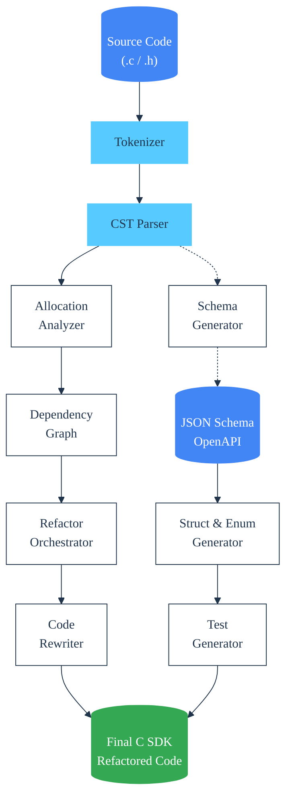
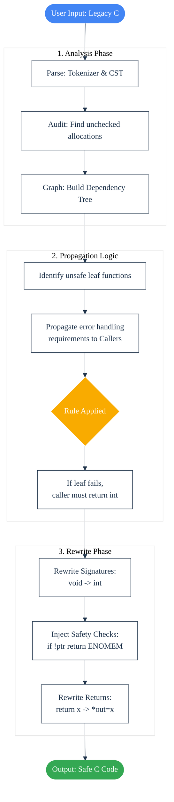

c-cdd
=====

[](https://opensource.org/licenses/Apache-2.0) 
[](https://github.com/SamuelMarks/cdd-c/actions/workflows/linux-Windows-macOS.yml) 
[`#rewriteInC`](https://rewriteInC.io) 
 
[](https://en.wikipedia.org/wiki/C89_(C_version)) 

**c-cdd** is a comprehensive frontend and tooling suite for C89. It treats C code and Data Definitions interchangeably, focusing on automated refactoring, safety analysis, and bi-directional generation between C structures and JSON Schemas/OpenAPI.

## Key Features

### 1. Automated "Void-to-Int" Refactoring & Safety Injection
The `fix` command performs a AST-level refactor of your codebase to enforce error propagation.
*   **Safety Injection:** Automatically detects unchecked memory allocations (`malloc`, `asprintf`, `strdup`, etc.) and injects safety checks (`if (!ptr) return ENOMEM;`).
*   **Signature rewriting:** Automatically converts `void func()` to `int func()` and `Type* func()` to `int func(Type **out)` to standardize error reporting.
*   **Propagation:** Uses a dependency graph to propagate these signature changes up the call stack to callers, updating call sites recursively.

### 2. C Data Classes (Structs & Enums)
Generates rich helper functions for your C `struct`s and `enum`s, providing high-level language ergonomics in C89:
*   **Serialization:** `Struct_to_json` / `Struct_from_json`
*   **Memory Management:** `Struct_cleanup` (recursive free), `Struct_deepcopy`
*   **Utilities:** `Struct_eq` (equality), `Struct_print`, `Struct_debug`
*   **Enums:** `Enum_to_str` / `Enum_from_str`

### 3. Schema <-> Code Synchronization
*   **code2schema:** Parses C headers to generate JSON Schema/OpenAPI Component definitions.
*   **schema2code:** Generates C headers and implementation files from JSON Schema.
*   **sync_code:** Keeps your manual `.c` implementation files in sync with header definitions, auto-generating boilerplate for new fields while preserving custom logic.

### 4. Project Audit
Static analysis tool that scans C projects to report on:
*   Unchecked memory allocations.
*   Functions that return allocated pointers directly (candidates for refactoring).

## Architecture

logic follows a pipeline of Tokenization -> concrete Syntax Tree (CST) -> Analysis -> Graph Generation -> Transformation.



## OpenAPI Client Generation Plan

The goal is to generate a full, compilation-ready C client library (SDK) from an OpenAPI 3.0+ specification.

### Current Status
| Component | Status | Description |
| :--- | :--- | :--- |
| **Data Models** | **90% Complete** | Parsing `components/schemas` and `$defs`. Generates C structs, enums, deep-copy, and JSON serialization. Supports nested objects and basic arrays. |
| **Paths/Operations** | **10% Complete** | The CLI can parse the file, but translation of HTTP verbs (`GET`, `POST`) to C function signatures is in the design phase. |
| **Network Layer** | **0% Complete** | Integration with a HTTP backend (e.g., `libcurl` or native sockets) is planned next. |
| **Parameter Handling** | **5% Complete** | Basic tokenization exists, but mapping `in: query` / `in: path` to C function arguments is pending. |

### Implementation Roadmap

1.  **Phase 1 (Done):** Generate C `struct`s from `components/schemas`.
2.  **Phase 2:** Analyze `paths` to generate C function prototypes.
  *   *Input:* `GET /pets/{petId}`
  *   *Output:* `int get_pets_by_id(const char* petId, struct Pet **out);`
3.  **Phase 3:** Implement URL construction logic (substituting `{petId}` in strings).
4.  **Phase 4:** Abstract Networking Interface (ANI) to allow swapping `libcurl` for other transports.

## Refactoring Workflow

The `fix` command uses a multi-pass approach to modernize legacy C code.



## CLI Reference

```
Usage: ./c_cdd_cli <command> [args]

Commands:
  audit <directory>
      Scan a directory for memory safety issues and output a JSON report.
  code2schema <header.h> <schema.json>
      Convert C header structs/enums to JSON Schema.
  fix <path> [--in-place] OR fix <input.c> <output.c>
      Refactor C file(s) to inject error handling. Supports directories.
  generate_build_system <build_system> <output_directory> <basename> [test_file]
      Generate CMake files.
  jsonschema2tests <schema.json> <header_to_test.h> <output-test.h>
      Generate test suite from schema.
  schema2code <schema.json> <basename>
      Generate C implementation from JSON Schema.
  sync_code <header.h> <impl.c>
      Sync implementation file with header declarations.

Options:
  --version   Print version information.
  --help      Print this help message.
```

### `c_cdd_cli`

The main entry point for the toolchain.

**Usage:** `./c_cdd_cli <command> [args]`

---

### `audit`

**Usage:** `audit <directory>`

Performs a static analysis scan on a C project to detect memory safety violations. It specifically looks for memory allocation functions where the result is used without checking for failure (e.g., `NULL` pointers).

*   **Arguments:**
    *   `<directory>`: The root path to recursively scan for `.c` files.
*   **Behavior:**
    *   Scans headers and source files for `malloc`, `calloc`, `realloc`, `strdup`, `asprintf`, and other standard allocators.
    *   Analyzes the AST to see if the assigned variable is checked (e.g., `if (!ptr)`) before being dereferenced.
*   **Output:**
    *   Prints a JSON report to `stdout` containing a summary of files scanned and a list of specific violations including file paths, line numbers, and variable names.

---

### `code2schema`

**Usage:** `code2schema <header.h> <schema.json>`

Parses C header files to extract data structures and generates a generic JSON Schema (compatible with OpenAPI 3.0 components).

*   **Arguments:**
    *   `<header.h>`: The input C header file containing `struct` and `enum` definitions.
    *   `<schema.json>`: The output file path for the JSON Schema.
*   **Behavior:**
    *   Maps C types to Schema types:
        *   `int` $\rightarrow$ `integer`
        *   `char *`, `const char *` $\rightarrow$ `string`
        *   `bool` $\rightarrow$ `boolean`
        *   `double` $\rightarrow$ `number`
        *   `struct X` $\rightarrow$ `$ref: "#/components/schemas/X"`
    *   Useful for bootstrapping an API definition from existing legacy C code.

---

### `fix`

**Usage:**
1. `fix <path> --in-place`
2. `fix <input.c> <output.c>`

Runs the automated refactoring engine ("Refactor Orchestrator") to inject safety checks and standardize error handling.

*   **Arguments:**
    *   `<path>`: A single file or a directory. If a directory is provided, it recursively processes all `.c` files.
    *   `--in-place`: **Required** if `<path>` is a directory. Overwrites the original files with the refactored versions.
    *   `<input.c> <output.c>`: Reads input, processes it, and writes to a new destination.
*   **What it does:**
    *   **Safety Injection:** Finds unchecked allocations (like `malloc`) and immediately injects `if (!ptr) return ENOMEM;`.
    *   **Signature Rewriting:** Converts functions returning `void` to return `int` (error code). Converts functions returning pointers to return `int` and pass the pointer via an output argument (e.g., `char* f()` becomes `int f(char **out)`).
    *   **Propagation:** Analyzes the call graph. If a low-level function definition is changed to return an error code, the engine updates all callers up the stack to check that error code.

---

### `generate_build_system`

**Usage:** `generate_build_system <build_system> <output_directory> <basename> [test_file]`

Scaffolds build configuration files for the generated code.

*   **Arguments:**
    *   `<build_system>`: Currently supports `cmake`.
    *   `<output_directory>`: Where to write the `CMakeLists.txt`.
    *   `<basename>`: The library name used in the build target.
    *   `[test_file]`: (Optional) If provided, generates build configurations that include test targets.

---

### `jsonschema2tests`

**Usage:** `jsonschema2tests <schema.json> <header_to_test.h> <output-test.h>`

Generates a C test suite using the `greatest.h` unit testing framework to verify the correctness of the code generated by `schema2code`.

*   **Arguments:**
    *   `<schema.json>`: The input schema defining the structures.
    *   `<header_to_test.h>`: The header file containing the C struct definitions (generated by `schema2code`).
    *   `<output-test.h>`: The output filename for the test suite.
*   **Tests Generated:**
    *   **Round-trip**: Verifies `Struct_to_json(Struct_from_json(x)) == x`.
    *   **Memory Management**: Verifies `Struct_cleanup` handles deep pointers correctly.
    *   **Deep Copy**: Verifies `Struct_deepcopy` creates valid independent copies.
    *   **Defaults**: Verifies `Struct_default` initializes fields correctly.

---

### `schema2code`

**Usage:** `schema2code <schema.json> <basename>`

The core code generator. Creates a C header and implementation file containing structs, enums, and comprehensive helper functions based on the provided schema.

*   **Arguments:**
    *   `<schema.json>`: A JSON Schema or OpenAPI specification.
    *   `<basename>`: The prefix for output files. Generates `<basename>.h` and `<basename>.c`.
*   **Generated API:**
    For a struct defined as `MyStruct`, it generates:
    *   `int MyStruct_from_json(const char *json, struct MyStruct **out);`
    *   `int MyStruct_to_json(const struct MyStruct *obj, char **out);`
    *   `void MyStruct_cleanup(struct MyStruct *obj);`
    *   `int MyStruct_deepcopy(const struct MyStruct *src, struct MyStruct **dest);`
    *   `int MyStruct_eq(const struct MyStruct *a, const struct MyStruct *b);`
    *   `int MyStruct_debug(const struct MyStruct *obj, FILE *fp);`

---

### `sync_code`

**Usage:** `sync_code <header.h> <impl.c>`

Synchronizes a C implementation file with its header. If you modify a struct in the `.h` file manually, this command updates the `.c` file to ensure the serialization and cleanup helpers match the new struct definition.

*   **Arguments:**
    *   `<header.h>`: The source of truth containing struct/enum definitions.
    *   `<impl.c>`: The implementation file to update.
*   **Behavior:**
    *   Parses the header to find new or modified fields.
    *   Regenerates the helper functions (`to_json`, `from_json`, `cleanup`, etc.) in the implementation file.
    *   **Note:** It specifically targets the generated helper functions. It is designed to coexist with your custom business logic functions in the same file.

## Compiling & Development

**Requirements:** CMake 3.11+, C Compiler (GCC/Clang/MSVC).

```sh
$ git clone "https://github.com/offscale/vcpkg" -b "project0"
# Windows:
$ vcpkg\bootstrap-vcpkg.bat
# Non-Windows:
$ ./vcpkg/bootstrap-vcpkg.sh
# Both Windows and non-Windows:
$ git clone "https://github.com/SamuelMarks/cdd-c" && cd "cdd-c"  # Or your fork of this repo
# Windows
$ cmake -DCMAKE_BUILD_TYPE="Debug" -DBUILD_TESTING=ON -DC_CDD_BUILD_TESTING=ON -DCMAKE_TOOLCHAIN_FILE="..\vcpkg\scripts\buildsystems\vcpkg.cmake" -S . -B "build"
# Non-Windows
$ cmake -DCMAKE_BUILD_TYPE='Debug' -DBUILD_TESTING=ON -DC_CDD_BUILD_TESTING=ON -DCMAKE_TOOLCHAIN_FILE='../vcpkg/scripts/buildsystems/vcpkg.cmake' -S . -B 'build'
# Both Windows and non-Windows:
$ cmake --build "build"
# Test
$ cd "build" && ctest -C "Debug" --verbose
```

## License

Licensed under either of

- Apache License, Version 2.0 ([LICENSE-APACHE](LICENSE-APACHE) or <https://www.apache.org/licenses/LICENSE-2.0>)
- MIT license ([LICENSE-MIT](LICENSE-MIT) or <https://opensource.org/licenses/MIT>)

at your option.

### Contribution

Unless you explicitly state otherwise, any contribution intentionally submitted for inclusion in the work by you, as
defined in the Apache-2.0 license, shall be dual licensed as above, without any additional terms or conditions.
