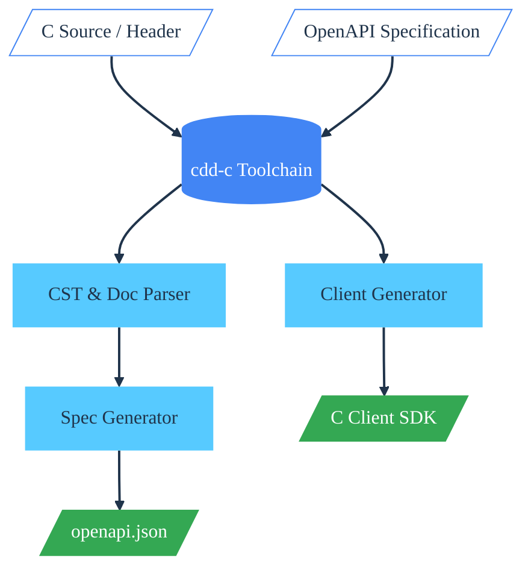

cdd-c
=====

[](https://opensource.org/licenses/Apache-2.0)
[](https://github.com/SamuelMarks/cdd-c/actions/workflows/linux-Windows-macOS.yml)
[`#rewriteInC`](https://rewriteInC.io)

[](https://en.wikipedia.org/wiki/C89_(C_version))

**cdd-c** is a comprehensive C frontend toolchain designed for interoperability, code generation, and static safety analysis. It acts as a bridge between C code and modern API specifications, focusing on:
1.  **Reverse Engineering**: Generating OpenAPI v3.2 specifications from annotated C source code.
2.  **SDK Generation**: Generating type-safe C client libraries from OpenAPI specs strings.
3.  **Refactoring**: Auditing and patching C code for memory safety (unchecked allocations).

OpenAPI 3.2 I/O support includes parameter styles (form/simple/matrix/label/spaceDelimited/pipeDelimited/deepObject/cookie), `allowEmptyValue`, content-based parameters (including parameter/header Media Type Objects with encoding/examples/schema), parameter/header schema `$ref` (including array items, plus non-component/external refs), inline primitive/array request/response schemas, inline schema `enum` (any JSON type)/`default` and `type` arrays (union types, including `null`), boolean schemas (`schema: true|false`), inline schema `const` (including array items `const`/`default`), deprecated `example`, plus JSON Schema `examples` arrays (including `items.examples`), inline schema numeric/string/array constraints (`minimum`/`maximum`/`exclusiveMinimum`/`exclusiveMaximum`, `minLength`/`maxLength`/`pattern`, `minItems`/`maxItems`/`uniqueItems`) including array item constraints, inline schema annotations (`description`, `deprecated`, `readOnly`, `writeOnly`) and `$ref` summary/description overrides, inline schema `format` and `contentMediaType`/`contentEncoding`, inline schema extra keyword passthrough for non-component schemas (including `x-` extensions, `$schema`/`$id`, `oneOf`/`anyOf`/`allOf`, `discriminator`, `xml`, `contentSchema`, and other custom keys), spec extension passthrough on non-schema objects (info/contact/license, tags, servers, paths, operations, parameters, headers, responses, request bodies, callbacks, links, security schemes, externalDocs, and security requirement objects), multi-content request/response maps, Media Type `encoding`, `prefixEncoding`, and `itemEncoding` for form/multipart, response headers, response links, callback objects, requestBody component `$ref` resolution, `components.requestBodies`, `components.mediaTypes`, `components.pathItems`, `components.links`, `components.callbacks`, `components.examples`, `additionalOperations`, content `$ref` to Media Type Objects, Media Type/Parameter/Header/Response/Request examples, component schema `allOf` (object) merging, `anyOf`/`oneOf` (first object) fallback, schema annotations (`description`, `format`, `deprecated`, `readOnly`, `writeOnly`), array constraints (`minItems`, `maxItems`, `uniqueItems`), JSON Schema keyword passthrough (`additionalProperties`, `patternProperties`, `$defs`, `not`, `if`/`then`/`else`, and other custom keys), raw component schemas for non-object/boolean/array definitions, components enum schemas (string) and required property lists, and security schemes including `mutualTLS`, OAuth2 flows, and `deprecated`. SDK generation supports array query serialization for `form` (default `explode=true` and explicit `explode=false` CSV), `spaceDelimited`, and `pipeDelimited` styles, `allowReserved` query encoding, object query serialization for `form` (explode true/false) and `deepObject` using `struct OpenAPI_KV`, object path serialization for `simple`/`label`/`matrix` (explode true/false) using `struct OpenAPI_KV`, object header serialization for `simple` (explode true/false), numeric parameters (`number`) for path/query/header/cookie (including arrays), cookie parameters (including `explode=false` arrays), simple header arrays, form-urlencoded and multipart/form-data request bodies (primitive fields + arrays), inline primitive/array JSON request and response bodies, matrix/label path serialization, apiKey security injection (header/query/cookie) and HTTP basic auth injection, additionalOperations for custom HTTP methods mapped to supported verbs (including `CONNECT`), and response selection for `default` and `xXX` status ranges.

OpenAPI compliance guards include path template validation (all `{param}` segments must have matching `in: path` parameters, and those parameters must be `required: true`), `paths` keys starting with `/`, component key regex validation (`^[a-zA-Z0-9._-]+$`), required parameter `name`/`in` fields with duplicate (`name` + `in`) detection, querystring parameters limited to a single occurrence and forbidden alongside `in: query` parameters, Header Objects restricted to `style: simple`, Media Type / Encoding Objects forbidding `encoding` alongside `prefixEncoding` or `itemEncoding`, unique tag names and `operationId` values, and media type selection that prefers the most specific content key (e.g. `text/plain` over `text/*`) while recognizing JSON types even when media type parameters are present.

## Workflow



## Example: C to OpenAPI to Client SDK

**cdd-c** allows you to maintain your API definition strictly within your C code using Doxygen-style annotations, generate a standard OpenAPI JSON file, and then generate a consumer SDK.

### 1. The Input (Server Implementation)

You annotate your C functions with `@route`, `@param`, and `@return`.

```c
/* server.c */

struct Pet {
  int id;
  char *name;
};

/**
 * @route GET /pets/{petId}
 * @summary Find pet by ID
 * @param petId [in:path] ID of pet to return
 * @return 200 Success
 */
int api_get_pet(int petId, struct Pet **out) {
  /* Implementation logic... */
  return 0;
}
```

You can also provide richer metadata:

- `@description <text>`
- `@operationId <id>`
- `@tag <name>` / `@tags <name1, name2>`
- `@deprecated [true|false]`
- `@externalDocs <url> [description]`
- `@security <scheme> [scope1, scope2]`
- `@server <url> [name=<name>] [description=<text>]`
- `@requestBody [required|required:true|required:false] [contentType:<media/type>] <description>`
- `@return <status> [contentType:<media/type>] <description>`
- `@param` flags: `[in:<path|query|header|cookie|querystring>] [required]`
  `[style:<form|simple|matrix|label|spaceDelimited|pipeDelimited|deepObject|cookie>]`
  `[explode:true|false] [allowReserved:true|false] [allowEmptyValue:true|false] [contentType:<media/type>]`

### 2. The Generated Specification (OpenAPI v3.2)

Running `c_cdd_cli c2openapi . openapi.json` produces:

```json
{
  "openapi": "3.2.0",
  "paths": {
    "/pets/{petId}": {
      "get": {
        "operationId": "api_get_pet",
        "summary": "Find pet by ID",
        "parameters": [
          {
            "name": "petId",
            "in": "path",
            "required": true,
            "schema": { "type": "integer" }
          }
        ],
        "responses": {
          "200": {
            "description": "Success",
            "content": {
              "application/json": {
                "schema": { "$ref": "#/components/schemas/Pet" }
              }
            }
          }
        }
      }
    }
  },
  "components": {
    "schemas": {
      "Pet": {
        "type": "object",
        "properties": {
          "id": { "type": "integer" },
          "name": { "type": "string" }
        }
      }
    }
  }
}
```

### 3. The Generated Client SDK

Running the client generator produces a C89 compatible library handling serialization, networking (Curl/WinHTTP), and error handling.

```c
/* main_client.c */
#include "generated_client.h"

int main(void) {
  struct HttpClient client;
  struct Pet *my_pet = NULL;
  struct ApiError *err = NULL;
  int rc;

  /* Initialize (Selects Libcurl or WinHTTP automatically) */
  api_init(&client, "https://api.petstore.com");

  /* Call the typed API */
  rc = api_get_pet(&client, 12, &my_pet, &err);

  if (rc != 0) {
    if (err) {
      printf("API Error: %s\n", err->detail);
      ApiError_cleanup(err);
    } else {
      printf("Transport Error: %d\n", rc);
    }
  } else {
    printf("Got Pet: %s (ID: %d)\n", my_pet->name, my_pet->id);
    Pet_cleanup(my_pet); /* Auto-generated cleanup */
  }

  api_cleanup(&client);
  return 0;
}
```

## Quick Start

### Dependencies
*   CMake 3.11+
*   C Compiler (GCC, Clang, MSVC)
*   **Libraries:** `parson`, `c89stringutils`, `c-str-span` (fetched automatically or via vcpkg).

### Building and testing

```sh
$ git clone "https://github.com/offscale/vcpkg" -b "project0"
# Windows:
$ vcpkg\bootstrap-vcpkg.bat
# Non-Windows:
$ ./vcpkg/bootstrap-vcpkg.sh
# Both Windows and non-Windows:
$ git clone "https://github.com/SamuelMarks/cdd-c" && cd "cdd-c"  # Or your fork of this repo
# Windows
$ cmake -DCMAKE_BUILD_TYPE="Debug" -DBUILD_TESTING=ON -DC_CDD_BUILD_TESTING=ON -DCMAKE_TOOLCHAIN_FILE="..\vcpkg\scripts\buildsystems\vcpkg.cmake" -S . -B "build"
# Non-Windows
$ cmake -DCMAKE_BUILD_TYPE='Debug' -DBUILD_TESTING=ON -DC_CDD_BUILD_TESTING=ON -DCMAKE_TOOLCHAIN_FILE='../vcpkg/scripts/buildsystems/vcpkg.cmake' -S . -B 'build'
# Both Windows and non-Windows:
$ cmake --build "build"
# Test
$ cd "build" && ctest -C "Debug" --verbose
```

More docs: [USAGE](./USAGE.md); [ARCHITECTURE](./ARCHITECTURE.md).
