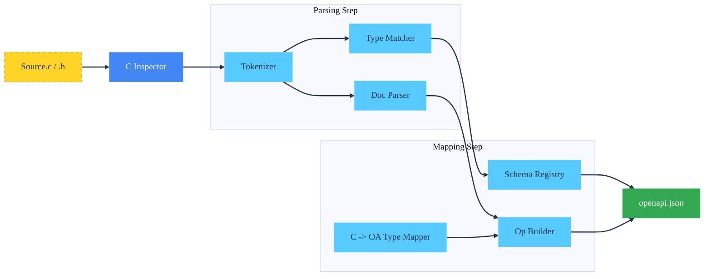

Usage
=====

The `c_cdd_cli` binary serves as the entry point for multiple modes of operation including auditing, schema extraction,
and code generation.

## Command Reference

### 1. Audit Project

Scans a directory for memory safety issues, specifically focusing on unchecked allocations (e.g., `malloc` results used
without `NULL` checks) and functions that return raw pointers.

```bash
c_cdd_cli audit <source_directory>
```

**Output:** Prints a summary of scanned files and a JSON object containing specific violations (file, line number,
variable name).

### 2. C to OpenAPI (c2openapi)

Generates an OpenAPI v3.2 JSON specification by analyzing C source code, function signatures, and Doxygen-style
comments.

```bash
c_cdd_cli c2openapi <source_directory> <output_spec.json>
```

**Annotations:**
To expose a C function to the OpenAPI generator, add documentation comments:

```c
/**
 * @route GET /users/{id}
 * @summary Get a user by ID
 * @param id [in:path] The user ID
 */
int api_get_user(int id, struct User **out);
```

**Notes:**
- Generated specs default to OpenAPI `3.2.0`.
- The loader/writer round-trips `$self`, `jsonSchemaDialect`, root `externalDocs`, and top-level `tags` metadata.
- Supported operation fields include `summary`, `description`, `deprecated`, `externalDocs`, and the HTTP `QUERY` method in addition to the standard verbs.
- The loader/writer round-trips `info` metadata (title/summary/description/terms/contact/license), root `servers`, `components.securitySchemes` (apiKey/http/openIdConnect + oauth2 metadata URL), root/operation `security` requirements, request body `description`/`required`, and response `description`/content media type.
- Parameter metadata `description`, `deprecated`, `allowReserved`, and `allowEmptyValue` are preserved in both directions; `@param` descriptions flow into generated OpenAPI.
- Parameter styles cover `form`, `simple`, `matrix`, `label`, `spaceDelimited`, `pipeDelimited`, `deepObject`, and `cookie`. Content-based parameters are parsed/emitted for any location.
- Inline primitive or array response/request schemas (e.g. `type: string`, `type: array` + `items`) are parsed and emitted without forcing `$ref`.
- Path Item `summary`/`description` and path-level `parameters` are preserved, and path-level parameters are merged into generated SDK signatures and request builders.
- Path Item `$ref` and path-/operation-level `servers` arrays are parsed and emitted to preserve overrides.
- `in: querystring` parameters are supported and treated as pre-serialized query strings; when present they take precedence over per-parameter query serialization.
- Server Variables (`servers[].variables`) are parsed and emitted, including `default`, `enum`, and `description`.
- Top-level `webhooks` are parsed and emitted using the same Path Item structure as `paths`.

### 3. C Header to JSON Schema (code2schema)

Extracts `struct` and `enum` definitions from a C header file and converts them into JSON Schema definitions.

```bash
c_cdd_cli code2schema <input_header.h> <output_schema.json>
```

---

## Data Flow Diagram

The following diagram illustrates how the `c2openapi` command processes source code into a specification.



## Generated Code Usage

When generating a client SDK (via `openapi2client` logic), the output includes:

1. **Transport abstraction**: `struct HttpClient` initialized with `_init()`.
2. **Helpers**: `_to_json`, `_from_json`, `_cleanup` for all models.
3. **Operations**: `api_verb_resource(ctx, params...)`.

### Standard Lifecycle

```c
struct HttpClient client;
struct User *u = NULL;
struct ApiError *err = NULL;

/* 0. Initialize (Selects Curl or WinHTTP automatically) */
api_init(&client, "https://api.example.com");

/* 1. Call Operation */
if (api_get_user(&client, 1, &u, &err) != 0) {
    printf("Error: %s\n", err->title);
    ApiError_cleanup(err);
} else {
    printf("User: %s\n", u->name);
    User_cleanup(u);
}

/* 2. Cleanup */
api_cleanup(&client);
```
