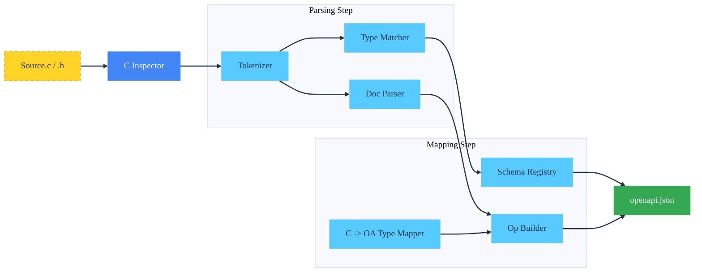

Usage
=====

The `c_cdd_cli` binary serves as the entry point for multiple modes of operation including auditing, schema extraction,
and code generation.

## Command Reference

### 1. Audit Project

Scans a directory for memory safety issues, specifically focusing on unchecked allocations (e.g., `malloc` results used
without `NULL` checks) and functions that return raw pointers.

```bash
c_cdd_cli audit <source_directory>
```

**Output:** Prints a summary of scanned files and a JSON object containing specific violations (file, line number,
variable name).

### 2. C to OpenAPI (c2openapi)

Generates an OpenAPI v3.2 JSON specification by analyzing C source code, function signatures, and Doxygen-style
comments.

```bash
c_cdd_cli c2openapi <source_directory> <output_spec.json>
```

**Annotations:**
To expose a C function to the OpenAPI generator, add documentation comments:

```c
/**
 * @route GET /users/{id}
 * @summary Get a user by ID
 * @param id [in:path] The user ID
 */
int api_get_user(int id, struct User **out);
```

Additional annotations supported:

- `@description <text>` for an operation description.
- `@operationId <id>` to override the default operationId.
- `@tag <name>` or `@tags <name1, name2>` to set operation tags.
- `@deprecated [true|false]` to mark an operation deprecated.
- `@externalDocs <url> [description]` to attach external docs metadata.
- `@security <scheme> [scope1, scope2]` to set operation security.
- `@server <url> [name=<name>] [description=<text>]` to add operation servers.
- `@requestBody [required|required:true|required:false] [contentType:<media/type>] <description>` to describe request bodies.
- `@return <status> [contentType:<media/type>] <description>` to describe response content.
- `@param` flags: `[in:<path|query|header|cookie|querystring>] [required]`
  `[style:<form|simple|matrix|label|spaceDelimited|pipeDelimited|deepObject|cookie>]`
  `[explode:true|false] [allowReserved:true|false] [allowEmptyValue:true|false] [contentType:<media/type>]`

**Notes:**
- Generated specs default to OpenAPI `3.2.0`.
- The loader/writer round-trips `$self`, `jsonSchemaDialect`, root `externalDocs`, and top-level `tags` metadata.
- Supported operation fields include `summary`, `description`, `deprecated`, `externalDocs`, and the HTTP `QUERY` method in addition to the standard verbs.
- The loader/writer round-trips `info` metadata (title/summary/description/terms/contact/license), root `servers`, `components.securitySchemes` (apiKey/http/openIdConnect + oauth2 metadata URL), root/operation `security` requirements, request body `description`/`required`, and response `description`/content media type.
- Media Type, Parameter, Header, Response, and Request Body examples (`example`, `examples`, `dataValue`, `serializedValue`, `externalValue`) plus `components.examples` are preserved.
- Parameter metadata `description`, `deprecated`, `allowReserved`, and `allowEmptyValue` are preserved in both directions; `@param` descriptions flow into generated OpenAPI.
- Parameter styles cover `form`, `simple`, `matrix`, `label`, `spaceDelimited`, `pipeDelimited`, `deepObject`, and `cookie`. Content-based parameters are parsed/emitted for any location.
- OpenAPI compliance guards: parameters/headers MUST use either `schema` or `content` (not both), and parameter/header `content` MUST contain exactly one media type; parameter `name`/`in` are required; parameter lists MUST NOT contain duplicates (`name` + `in`); querystring parameters are limited to a single occurrence and are forbidden alongside `in: query` parameters; header parameters named `Accept`, `Content-Type`, or `Authorization` are ignored; response/encoding headers named `Content-Type` are ignored; Header Objects only allow `style: simple`; Media Type / Encoding Objects MUST NOT combine `encoding` with `prefixEncoding` or `itemEncoding`; `paths` keys must start with `/`; component keys must match `^[a-zA-Z0-9._-]+$`; tag names and `operationId` values must be unique; path templates must have matching `in: path` parameters and those parameters must be `required: true`.
- SDK generation now supports array query serialization for `form` (default `explode=true` and explicit `explode=false` CSV), plus `spaceDelimited` and `pipeDelimited` array styles, `allowReserved` query encoding, object query serialization for `form` (explode true/false) and `deepObject` using `struct OpenAPI_KV`, object path serialization for `simple`/`label`/`matrix` (explode true/false) using `struct OpenAPI_KV`, object header serialization for `simple` (explode true/false), cookie parameters (including `explode=false` arrays), simple header arrays, form-urlencoded and multipart/form-data request bodies (primitive fields + arrays), apiKey security injection (header/query/cookie) and HTTP basic auth injection, inline primitive/array JSON request and response bodies, and response selection for `default` and `xXX` status ranges.
- Inline primitive or array response/request schemas (e.g. `type: string`, `type: array` + `items`) are parsed and emitted without forcing `$ref`.
- Media type selection for request/response content prefers the most specific key (e.g. `text/plain` over `text/*`) and recognizes JSON types even when media type parameters are present.
- Inline schema `enum` (any JSON type)/`default` and `type` arrays (union types, including `null`) are preserved on request/response/parameter/header schemas, along with boolean schemas (`schema: true|false`).
- Inline schema `const`, deprecated `example`, JSON Schema `examples` arrays (including `items.examples`), numeric/string/array constraints (`minimum`/`maximum`/`exclusiveMinimum`/`exclusiveMaximum`, `minLength`/`maxLength`/`pattern`, `minItems`/`maxItems`/`uniqueItems`) including array item constraints, schema annotations (`description`, `deprecated`, `readOnly`, `writeOnly`), and `$ref` summary/description overrides are preserved on request/response/parameter/header schemas.
- Media Type Encoding supports `encoding`, `prefixEncoding`, and `itemEncoding`, including nested Encoding Objects.
- Parameter/Header `content` preserves full Media Type Objects (schema/encoding/examples) when round-tripping specs.
- JSON Schema constraints `minimum`/`maximum`, numeric `exclusiveMinimum`/`exclusiveMaximum`, `minLength`/`maxLength`, `pattern`, `default`, `minItems`/`maxItems`, and `uniqueItems` round-trip between OpenAPI and generated StructFields; schema annotations (`description`, `format`, `deprecated`, `readOnly`, `writeOnly`) are preserved as well.
- JSON Schema keywords `additionalProperties`, `patternProperties`, `$defs`, `not`, `if`/`then`/`else`, and other custom keys are preserved on component and property schemas during loader/writer round-trips.
- Inline schema extra keywords (including `x-` extensions, `$schema`/`$id`, `oneOf`/`anyOf`/`allOf`, `discriminator`, `xml`, `contentSchema`, and other custom keys) are preserved for parameters/headers/request/response media types, including array items `const`/`default`.
- Spec extensions (`x-` fields) on non-schema objects are preserved (info/contact/license, tags, servers, paths, operations, parameters, headers, responses, request bodies, callbacks, links, security schemes, security requirement objects, externalDocs).
- Component schema `allOf` (object) merges are supported when loading OpenAPI into StructFields; `anyOf`/`oneOf` select the first object schema as a best-effort fallback.
- Path Item `summary`/`description` and path-level `parameters` are preserved, and path-level parameters are merged into generated SDK signatures and request builders.
- Path Item `$ref` and path-/operation-level `servers` arrays are parsed and emitted to preserve overrides.
- `in: querystring` parameters are supported and treated as pre-serialized query strings; when present they take precedence over per-parameter query serialization.
- Server Variables (`servers[].variables`) are parsed and emitted, including `default`, `enum`, and `description`.
- Top-level `webhooks` are parsed and emitted using the same Path Item structure as `paths`.
- OAuth2 flow definitions under `components.securitySchemes` are parsed and emitted (implicit, password, client credentials, authorization code, device authorization).
- Non-component/external schema `$ref` values (including array item `$ref`) are preserved during round-trips.
- Component schemas that are non-object/boolean/array are preserved as raw JSON and re-emitted.

### 3. C Header to JSON Schema (code2schema)

Extracts `struct` and `enum` definitions from a C header file and converts them into JSON Schema definitions.

```bash
c_cdd_cli code2schema <input_header.h> <output_schema.json>
```

---

## Data Flow Diagram

The following diagram illustrates how the `c2openapi` command processes source code into a specification.



## Generated Code Usage

When generating a client SDK (via `openapi2client` logic), the output includes:

1. **Transport abstraction**: `struct HttpClient` initialized with `_init()`.
2. **Helpers**: `_to_json`, `_from_json`, `_cleanup` for all models.
3. **Operations**: `api_verb_resource(ctx, params...)`.
4. **Serialization support**: form-urlencoded request bodies and matrix/label
   path parameter styles in generated clients.

### Standard Lifecycle

```c
struct HttpClient client;
struct User *u = NULL;
struct ApiError *err = NULL;

/* 0. Initialize (Selects Curl or WinHTTP automatically) */
api_init(&client, "https://api.example.com");

/* 1. Call Operation */
if (api_get_user(&client, 1, &u, &err) != 0) {
    printf("Error: %s\n", err->title);
    ApiError_cleanup(err);
} else {
    printf("User: %s\n", u->name);
    User_cleanup(u);
}

/* 2. Cleanup */
api_cleanup(&client);
```
